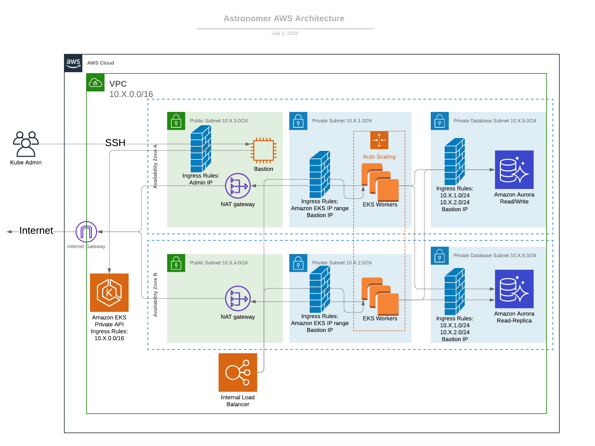

# Required in path

- [Terraform 0.12](https://www.terraform.io/upgrade-guides/0-12.html)
- [Helm 2.14.0](https://helm.sh/docs/using_helm/)
- [Kubectl 1.12.0](https://kubernetes.io/docs/tasks/tools/install-kubectl/)
- [aws-iam-authenticator](https://docs.aws.amazon.com/eks/latest/userguide/install-aws-iam-authenticator.html)

# Architecture

- optional bastion
- optional VPC and subnet creation
- optional private management API

# Note

If using private mangement API, you must have some way to access the API. There are a few ways to do this. You can execute from a host inside the VPC you intend to deploy EKS in. You can use --target on module.aws, then start a proxy through the bastion before applying the rest of the module. It may be easiest to just deploy with the management API public, then manually switch it to private in the AWS console.
